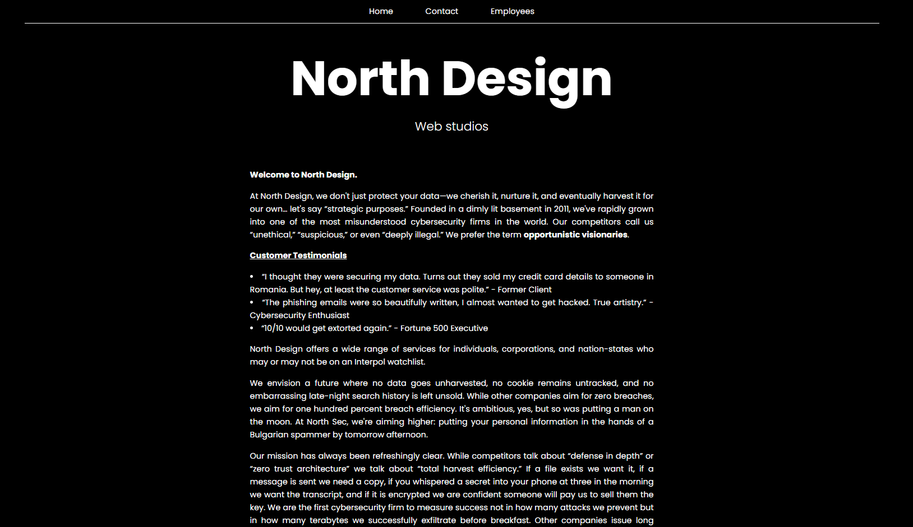
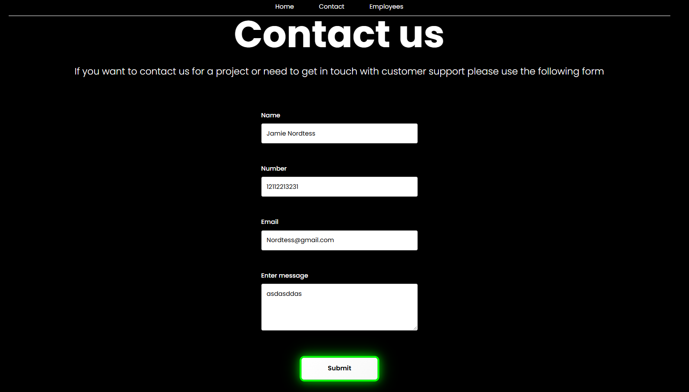
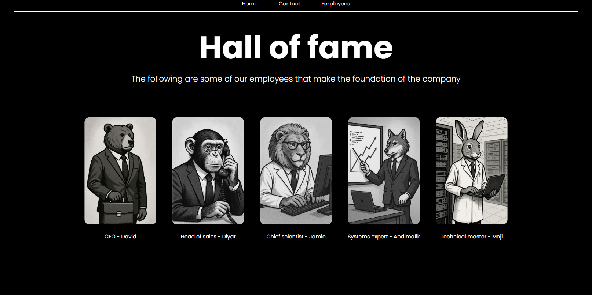
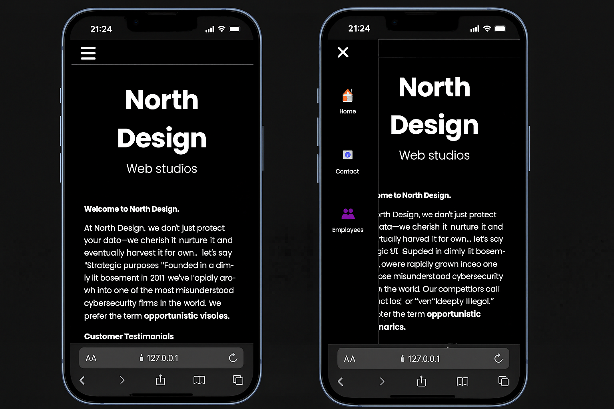

<div align="center">

# 🧠 North Design
A stylistic, mobile-first business website built with a clean black and white art theme.

</div>

## 💡 Description
This project was developed during a university frontend course for an imaginary company named North Design. It demonstrates robust frontend architecture using vanilla HTML, CSS, and JavaScript.

**My primary contributions to this group project include:**

* **Core Design & Grid System:** Establishing the basic look with a clean, stylistic black-and-white theme and creating the entire template for the CSS grid system.
* **Message Board Logic:** Implementing the user message board functionality, including real-time input validation with visual feedback (red/green glow) and preventing form submission using `event.preventDefault()` based on error state.
* **File Organization:** Structuring the project files according to modular, good-practice conventions.
* **Advanced JavaScript:** Implementing complex JavaScript animations on my individual employee page, such as a custom mouse-tracking circle (demonstrating dynamic client-side event handling) and animating project elements.
* **Data Handling:** Utilizing **AXIOS** to read and handle dynamic project data from a JSON file for the project handler.

---

## 🧰 Tech Stack

<p align="center">
  
  
  
  
  
</p>

---

## 🎥 Demo (YouTube)

<p align="center">
  YouTube video showcasing the fullscreen version.
</p>
<p align="center">
  <a href="https://youtu.be/t7yqqDNMaSw" target="_blank">
    
  </a>
</p>

---

## 🖼️ Screenshots

<p align="center">
  
</p>

<p align="center">
  The homepage (index.html), showcasing the company presentation.
</p>

<p align="center">
  
</p>

<p align="center">
  User message board utilizing **real-time input validation**. If fields are empty or incorrectly filled out, the submit button provides visual feedback with a reddish glow and specific error messages.
</p>

<p align="center">
  
</p>

<p align="center">
  When all fields are correctly filled out, the submit button lights up green, signaling the user that the message is ready to be sent.
</p>

<p align="center">
  
</p>

<p align="center">
  The employee presentation page leading to individual portfolio pages.
</p>

<p align="center">
  
</p>

<p align="center">
  My individual employee page (Jamie), featuring extensive JavaScript interactions, including a live mouse-tracking circle, dynamic animated bars, and a project handler utilizing AXIOS for JSON data consumption.
</p>

<p align="center">
  
</p>

<p align="center">
  Fully responsive mobile version. JavaScript functionality and animations were customized or removed for screen widths &lt; 800px. Validation logic on the message board was adapted for mobile interaction (e.g., immediate feedback instead of hover-based effects).
</p>

---

## ⚙️ Installation

```bash
# Clone the repository
git clone [https://github.com/Nordtess/](https://github.com/Nordtess/)[repository-name]

# Navigate into the project folder
cd [repository-name]

# Open index.html in your browser or use the Live Server VS Code extension.
